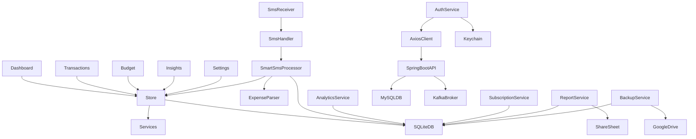
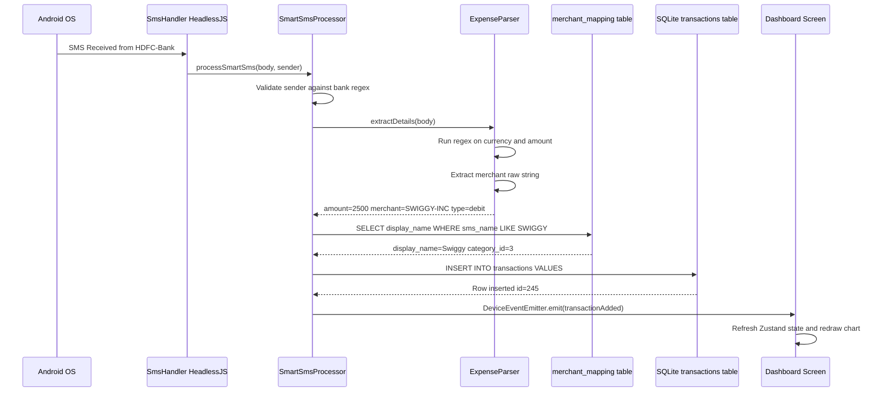
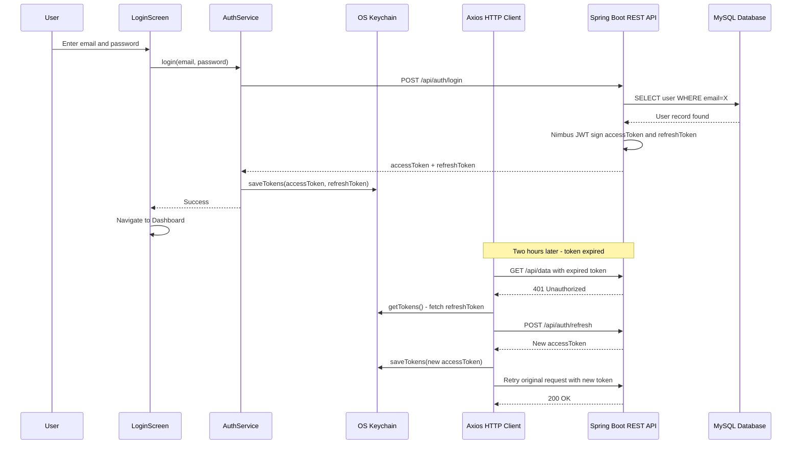
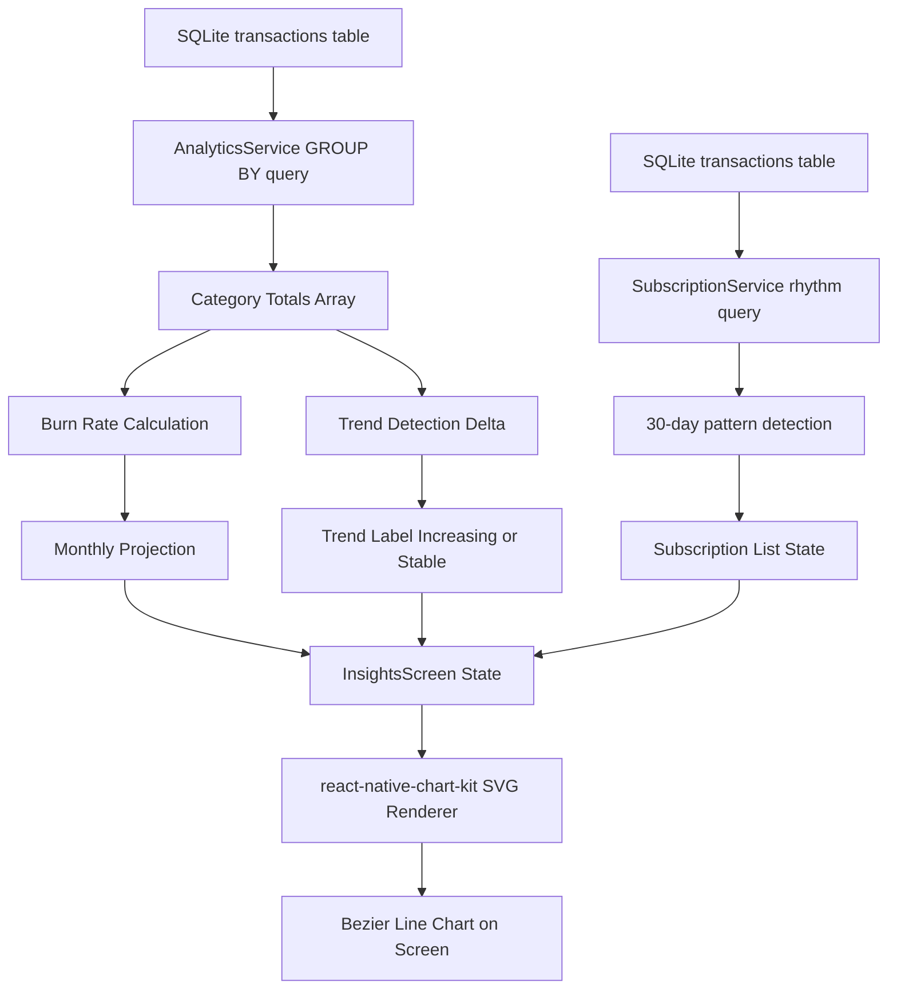
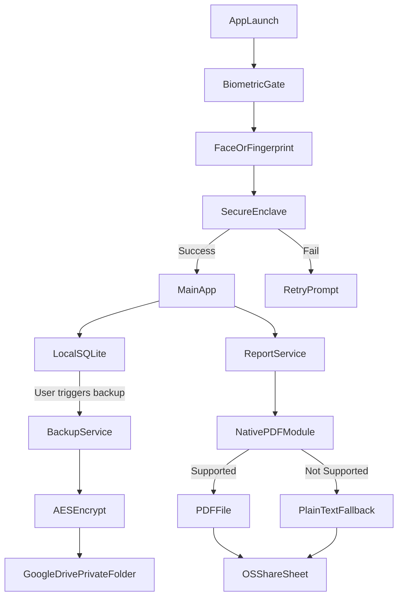

# Expense Tracker: Complete Architecture and Flow Guide

This document provides the full technical architecture of the Smart Expense Tracker, including one top-level system map and four dedicated flow diagrams, each with detailed explanations.

---

## 1. Master System Architecture Diagram

A complete map of every module and how they interact at runtime.

**What this map shows:**
- All 5 main screens feed into the Zustand **Store**
- The Store syncs with **on-device SQLite** (local-first design)
- The **SMS pipeline** runs entirely on-device without any server calls
- Only **AuthService** communicates with the external **Java Spring Boot** backend
- The backend persists user identity in **MySQL** and publishes events to **Kafka**

---

## 2. Flow A: The Autonomous SMS Pipeline

How a bank SMS becomes a transaction in the ledger — without any user input.

**Step-by-Step Explanation:**

1. **OS Intercept**: The Android system receives an SMS. The `BroadcastReceiver` registered in `AndroidManifest.xml` intercepts it and wakes up the app silently.
2. **HeadlessJS Task**: `SmsHandler.ts` registers a HeadlessJS task via `AppRegistry.registerHeadlessTask`. Android boots a minimal JS runtime (no UI, no React tree) just to run this one function.
3. **Sender Validation**: `SmartSmsProcessor` immediately checks the sender ID against a regex for bank headers. Any non-bank sender (OTP, promotional SMS) is discarded in RAM — never written to disk.
4. **Regex Parsing**: `ExpenseParser` runs a multi-pattern regex suite over the message body to locate: transaction type (`debited`/`credited`), the exact rupee amount (e.g., `Rs.2,500`), the merchant string (e.g., `SWIGGY-INTECH`).
5. **Merchant Lookup**: The raw merchant string is matched against the local `merchant_mapping` SQLite table. If a rule exists, the ugly string is replaced with its clean `display_name` and given a `category_id`.
6. **Database Insert**: The final, clean transaction object is inserted into the `transactions` SQLite table using the `react-native-sqlite-storage` C++ bridge.
7. **Event Broadcast**: `DeviceEventEmitter.emit('transactionAdded')` fires a broadcast. If the Dashboard screen is mounted and listening, it triggers a Zustand state refresh which redraws all charts and totals — instantly, with zero user interaction.

---

## 3. Flow B: Self-Healing Authentication

How JWT tokens are managed invisibly between the React Native app and the Java Spring Boot backend.

**Step-by-Step Explanation:**

1. **Login Request**: `LoginScreen` collects credentials and calls `AuthService.login()`, which fires `POST /api/auth/login` via the Axios client to the Spring Boot server at `https://smartexpensetracker-bjlu.onrender.com`.
2. **Spring Security Validates**: The Spring Boot service uses `Spring Security` to authenticate the request. It queries **MySQL** for the user record, verifies the bcrypt-hashed password, and on success uses **Nimbus JOSE+JWT** to generate a short-lived `accessToken` (15 min) and long-lived `refreshToken` (30 days).
3. **Secure Storage**: Both tokens are written to the device's **hardware-backed Keychain** (`react-native-keychain`). They are stored inside the Secure Enclave on iOS or Android Keystore — inaccessible to other apps or regular file-system reads.
4. **Auto Token Injection**: Every subsequent HTTP request passes through the Axios **request interceptor**, which silently reads the `accessToken` from Keychain and injects `Authorization: Bearer <token>` into the headers.
5. **401 Detection**: When the `accessToken` expires, the Spring Boot server returns `401 Unauthorized`. The Axios **response interceptor** catches this before the screen ever sees it.
6. **Silent Refresh**: The interceptor posts the `refreshToken` to `/api/auth/refresh`. If successful, the new `accessToken` is saved to Keychain and the original failed request is retried transparently.
7. **Cold-Start Tolerance**: The Axios timeout is set to **60 seconds** specifically to handle Render.com free-tier cold starts, where the Java JVM can take 30-50 seconds to boot after inactivity.

---

## 4. Flow C: Analytics and Insights Pipeline

How raw transaction rows become statistical insights and charts.

**Step-by-Step Explanation:**

1. **Heavy Query Delegation**: When `InsightsScreen` opens, it does NOT load thousands of transaction rows into JavaScript. That would exhaust mobile RAM and freeze the UI thread.
2. **Aggregated SQL**: `AnalyticsService` fires `SELECT category_id, SUM(amount), COUNT(*) FROM transactions WHERE date > ? GROUP BY category_id` directly on the **SQLite C++ engine**. The C++ layer processes all rows in microseconds and returns only the tiny result matrix.
3. **Burn Rate**: Daily spending velocity = `totalThisMonth / currentDayOfMonth`. Projected monthly total = `dailyVelocity * daysInMonth`.
4. **Trend Detection**: The 7-day current window spending is compared against the previous 7-day window. A delta > 10% upward triggers the "Increasing" label; below 10% is "Stable".
5. **Subscription Engine**: `SubscriptionService` separately runs a query to find merchant+amount pairs that recur within a 25-35 day window (monthly) or 6-8 day window (weekly). These are flagged as detected subscriptions.
6. **State Hydration**: All computed results are written into the Zustand store slice that `InsightsScreen` subscribes to.
7. **SVG Rendering**: `react-native-chart-kit` receives the numeric arrays and maps them through a Bezier curve function, drawing smooth SVG paths that animate using React Native's `Animated` API.

---

## 5. Flow D: Multi-Layer Security and Fallback Architecture

How the app protects data at rest, in transit, and at the hardware perimeter.

**Step-by-Step Explanation:**

1. **Biometric Gate**: On every app launch (or after 5 minutes of backgrounding), `BiometricLockScreen` is rendered above all other screens. It calls `react-native-biometrics`, which hands control entirely to the OS. The JS thread is paused — fingerprint or face template data is never exposed to JavaScript.
2. **Back Button Block**: `BackHandler.addEventListener('hardwareBackPress', () => true)` consumes all back events, preventing the user from pressing Android's Back button to skip the lock screen.
3. **Inactivity Timer**: `AppState.addEventListener` in `App.tsx` listens for the app going to background. When it returns from background after 5 minutes, the biometric gate is re-raised automatically.
4. **Local-First Privacy**: All transaction data lives exclusively in **on-device SQLite**. The remote Spring Boot server stores only hashed credentials — it never receives raw financial data.
5. **AES Encrypted Backup**: When the user initiates a backup from Settings, `BackupService` locates the `.sqlite` file via `react-native-fs`, reads the raw binary, encrypts it using **AES-256-GCM** with an ephemeral salt, and uploads the ciphertext blob to Google Drive's **hidden `appDataFolder`** — invisible to the user's Drive app and inaccessible to other apps.
6. **PDF Generation with Graceful Fallback**: `ReportService` builds an HTML string and attempts to call the native `PDFGenerator` bridge module. If the device does not support native PDF generation, `try/catch` intercepts the `NativeModules` error. The service downgrades to sharing a plain-text or HTML version via the native **OS Share Sheet** (WhatsApp, Email, AirDrop, etc.) with zero crash.
