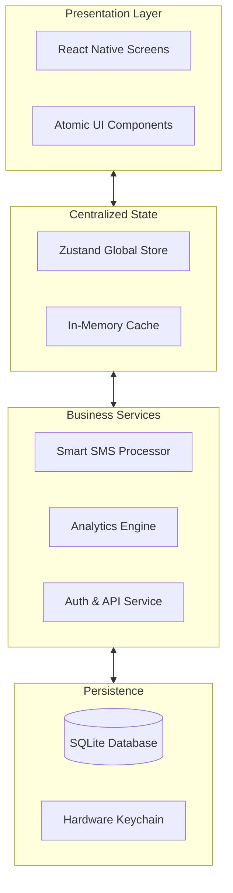
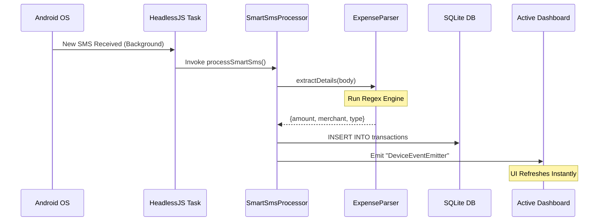
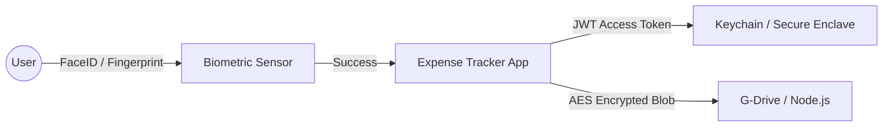
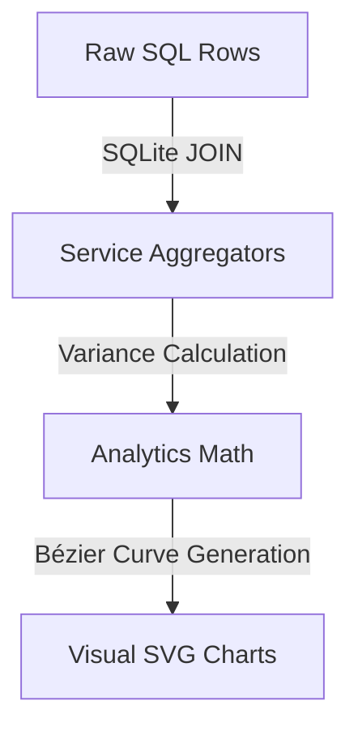

# 🏗️ Expense Tracker: Architectural Master Guide

This guide provides a comprehensive deep-dive into the technical foundations of the Smart Expense Tracker. Use the carousel below to explore the different layers of the system.

````carousel
# Layer 1: System Topology
## High-Level Module Stack

The application follows a strict 4-tier architectural pattern to separate concerns and ensure high performance on mobile hardware.



### Technical Breakdown:
1.  **UI Layer**: Built with React Native and TSX. It is purely declarative and reacts to state changes in the Store.
2.  **State Layer (Zustand)**: Acts as the "Single Source of Truth". It prevents "prop drilling" and ensures that if a transaction is added in the background, the UI updates instantly.
3.  **Logic Layer**: Standard TypeScript services that handle the "heavy lifting" (Regex parsing, math, network requests).
4.  **Data Layer**: Uses `react-native-sqlite-storage` for the ledger and `react-native-keychain` for cryptographic tokens.

<!-- slide -->
# Layer 2: The Automation Pipeline
## Background SMS Processing Flow

This flow is the "magic" of the app. It allows the system to capture data without any user effort.



### Technical Breakdown:
-   **Native Trigger**: The Android `BroadcastReceiver` intercepts the SMS arrival.
-   **HeadlessJS**: A background environment that runs Javascript even when the app is closed.
-   **Regex Engine**: A highly optimized set of patterns that look for keywords like "Debited", "Spent", and currency symbols.
-   **Event Emission**: Uses the native bridge to tell the React tree to re-fetch data from the disk so the charts stay real-time.

<!-- slide -->
# Layer 3: Security & Data Privacy
## The Trust Architecture

Security is handled at the hardware level to ensure financial data is never exposed.



### Technical Breakdown:
1.  **Biometric Gating**: The app entry is protected by `react-native-biometrics`. The app never sees your fingerprint data; it only receives a success/fail signal from the OS.
2.  **Secure Enclave**: Authentication tokens (JWTs) are stored in the device's hardware-backed Keychain, not in standard local storage, making them immune to simple data extractions.
3.  **Encrypted Backups**: Before a backup is uploaded to Google Drive, the SQLite file is encrypted using **AES-256**. Even if someone gains access to your Google Drive, the database file remains an unreadable scrambled blob without the app's secret key.

<!-- slide -->
# Layer 4: Intelligence & Analytics
## Data Aggregation Flow

The system transforms raw rows of transaction data into visual insights through a multi-stage aggregation pipeline.



### Technical Breakdown:
-   **Burn Rate**: The `AnalyticsService` calculates the "Daily Velocity" by dividing total monthly spend by the current day of the month.
-   **Trend Detection**: It compares the current 7-day window against the previous 7-day window to determine if spending is "Increasing" or "Stable".
-   **Subscription Engine**: A heuristic-based scanner that looks for identical amounts spent at the same merchant in 30-day rhythm intervals.
-   **Native Charts**: Uses `react-native-chart-kit` to map discrete data points into smooth mathematical curves for the user.
````
