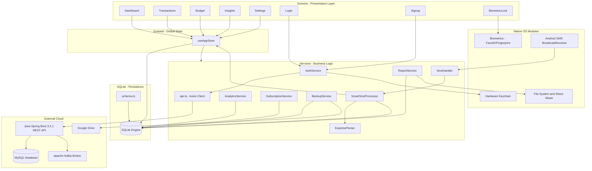
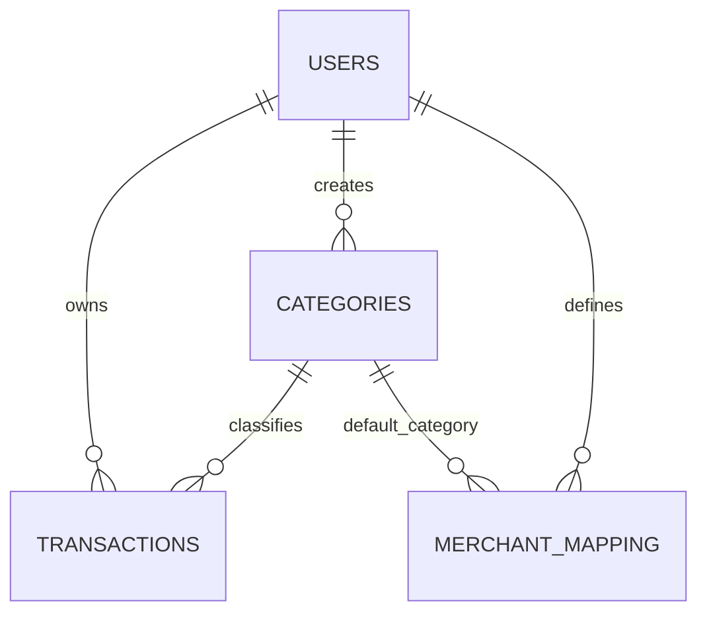
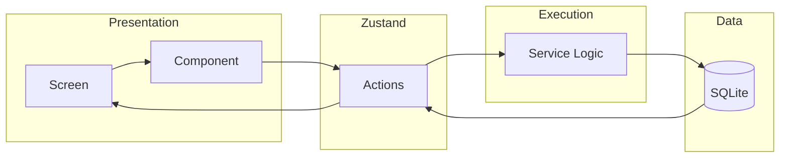

# 📄 Comprehensive Architecture Specification: Smart Expense Tracker

This document serves as the authoritative technical specification for the Smart Expense Tracker application. It outlines the structural design, data integrity protocols, security implementation, and core logic pipelines.

---

## 1. Executive Summary

The Smart Expense Tracker is a **local-first, privacy-centric** mobile application designed to automate personal finance management through SMS interception and deterministic parsing. It is composed of a React Native mobile client and a Java Spring Boot backend. Key architectural drivers include hardware-level security, offline availability, and high-performance data aggregation.

---

## 2. System Architecture Overview

This diagram maps every major module in the application and shows how they interact with each other at runtime.



### Diagram Key
| Shape | Role |
| :--- | :--- |
| `Box` | Application module or service |
| `[(Box)]` | Database / persistent store |
| `-->` | Unidirectional data or function call |

### 🔍 Flow Explanation — System Architecture

**1. User Authentication Entry Point**
When the app first launches, `App.tsx` checks the Zustand store for an `isAuthenticated` flag. If `false`, React Navigation renders the Auth Stack, pushing `Login` and `Signup` onto the screen. These screens call `AuthService`, which sends credentials over HTTPS to the **Java Spring Boot REST API**. The Spring Boot server uses **Spring Security + Nimbus JOSE+JWT** to validate credentials against MySQL, generate a JWT `accessToken` and `refreshToken`, and return them in the response body. `AuthService` stores both in the **Hardware Keychain** (iOS Secure Enclave / Android Keystore).

**2. Main Tab Navigation**
Once authenticated, the `BiometricLock` screen is shown (if the user has enabled it in Settings). It bridges to the native `Biometrics` module, which pauses the JavaScript thread and hands full control to the OS for fingerprint/face scanning. On success, all main screens become accessible: `Dashboard`, `Transactions`, `Budget`, `Insights`, and `Settings`.

**3. Screen → Store → Database Read Cycle**
Every main screen reads data via `useAppStore` (Zustand). When a screen mounts, it triggers a store action (e.g., `loadTransactions`). The action calls the relevant database function from `database.ts`, which executes a SQL query against the `SQLite Engine`. The result is written back into Zustand's in-memory state, which triggers React's re-render of the screen.

**4. The Background SMS Pipeline**
When a bank SMS arrives, the `Android SMS BroadcastReceiver` wakes up `SmsHandler`, runs it inside a `HeadlessJS` background task (no UI required), and invokes `SmartSmsProcessor`. The processor validates the sender, cleans the raw text via `ExpenseParser`, and inserts the result directly into `SQLite`. It then fires a `DeviceEventEmitter` broadcast. If the `Dashboard` screen is open, its listener receives the signal and refreshes Zustand, instantly re-drawing the charts.

**5. Analytics and Subscriptions**
`AnalyticsService` and `SubscriptionService` query the `SQLite Engine` directly using `GROUP BY`, `SUM`, and `COUNT` aggregates. These never go outside the device — all statistical computations happen on the embedded C++ SQLite layer for speed.

**6. Backup Flow**
`BackupService` reads the physical `.sqlite` file path, encrypts the binary using AES-256-GCM, and dispatches it to `Google Drive` via OAuth. This keeps a cold disaster-recovery copy of all financial data, encrypted and invisible inside the private `appDataFolder`.

**7. Report / Share Flow**
`ReportService` queries `SQLite`, builds an HTML document in memory, converts it to PDF via native modules, then invokes the `File System and Share Sheet`. This gives the user the native iOS/Android share dialog (WhatsApp, Email, AirDrop, etc.).

---

## 3. Directory Architecture

The project structure is optimized for modularity and separation between Native-bridged services and React-based UI components.

```text
/mobile
├── src/
│   ├── components/      # Atomic UI units (Modals, Custom Inputs)
│   ├── database/        # Persistence Layer (SQLite Schemas & Migrations)
│   ├── screens/         # High-level UI routing targets
│   ├── services/        # Business Logic & Native Bridges
│   │   ├── Analytics/   # Math & Trend Calculators
│   │   ├── Auth/        # Session & Token Management
│   │   ├── Parser/      # Regex & NLP Engines
│   │   └── Sms/         # Background Receiver Logic
│   ├── store/           # Zustand Global State Slices
│   └── utils/           # Shared Helpers (Formatters, Constants)
```

---

## 3. Relational Database Schema

The persistence layer relies on an embedded SQLite engine. Relationships are strict to maintain referential integrity.

### Entity Relationship Diagram


### Table Specifications
| Table | Description | Critical Fields |
| :--- | :--- | :--- |
| **users** | Auth identity | `id`, `email`, `password_hash` |
| **transactions** | The financial ledger | `id`, `amount`, `date`, `merchant`, `category_id` |
| **categories** | User-defined buckets | `id`, `name`, `budget_limit`, `icon`, `color` |
| **merchant_mapping**| Rule-based classification | `sms_name`, `display_name`, `category_id` |

### 🔍 Flow Explanation — Database Relationships

- **USERS → TRANSACTIONS (1-to-many)**: Every financial ledger entry is owned by exactly one user via `user_id` foreign key. When the user logs out, their data is filtered by this ID — it never leaks across accounts.
- **USERS → CATEGORIES (1-to-many)**: Categories (Food, Transport, etc.) are user-created and stored locally. Each has an optional `budget_limit` field, enabling per-category budget alerts.
- **USERS → MERCHANT_MAPPING (1-to-many)**: The rule-book that maps raw SMS merchant strings (e.g., `UBER-BLR`) to clean display names (e.g., `Uber`). Each rule points to a `category_id`, enabling fully automatic transaction categorization.
- **CATEGORIES → TRANSACTIONS (1-to-many)**: The `category_id` foreign key on each transaction enables `GROUP BY` aggregation — this is how the pie chart in the Dashboard and the progress bars in the Budget screen are computed in a single SQL query.
- **CATEGORIES → MERCHANT_MAPPING**: Each merchant rule has a default category, so when a new transaction is captured from SMS, the category can be assigned without user intervention.

---

## 4. Service Interaction Pattern

The UI never communicates with the Database directly. It follows a unidirectional flow:
**UI Component** -> **Store Action** -> **Service Logic** -> **SQLite Engine**.



### 🔍 Flow Explanation — Service Interaction Pattern

This diagram enforces a strict **one-way dependency rule**. No Screen or Component ever calls the database directly. Here is the full cycle:

1.  **User triggers a UI event** (e.g., taps "Add Transaction").
2.  **Screen calls a Store Action** (e.g., `useAppStore().addTransaction(...)`). The screen does not know anything about SQL or file paths.
3.  **Store Action invokes Service Logic** (e.g., `database.insertTransaction()`). This is where the raw TypeScript function runs, validates inputs, and builds the SQL statement.
4.  **Service writes to SQLite** via the `react-native-sqlite-storage` C++ bridge.
5.  **SQLite confirms success** and returns the new row ID.
6.  **Store updates its in-memory state** (`transactions = [...transactions, newItem]`).
7.  **React detects the state change** and re-renders the Screen with the new data.

> [!NOTE]
> This pattern is local-only. The backend components involved in authentication are:
| Component | Role |
| :--- | :--- |
| **Java Spring Boot 3.2.1** | REST API backend (Authentication only) |
| **MySQL (Production)** | Backend user store for credentials |
| **H2 (Development)** | In-memory backend DB for local testing |
| **Apache Kafka** | Backend event streaming |
| **Nimbus JOSE+JWT** | JWT generation and verification on server |
| **Spring Security** | Request authentication and authorization |
All transaction data stays on-device in SQLite — it is never sent to the server.

---

## 5. Security & Privacy Framework

### 🔒 Identity & Access
- **Gating**: Application-level biometric challenge via `react-native-biometrics`.
- **Inactivity**: Automatic state lock after 5 minutes of background inactivity (controlled via `App.tsx` state listeners).

### 🔑 Cryptography
- **At Rest**: Local SQLite database storage is protected by OS-level file-system isolation.
- **In Transit**: Backups are encrypted with **AES-256 (GCM)** before dispatch to Google Drive.
- **Keys**: All sensitive JWTs and encryption keys are stored in the **Hardware-Backed Keychain (Secure Enclave)**.

### 🛡️ PII Protection (Privacy by Design)
- **Local-First**: 100% of financial data stays on the device.
- **Selective Sync**: Only non-sensitive statistical aggregates (if enabled) are ever sent to the analytical backend.
- **Spam Filtering**: The `SmartSmsProcessor` uses a local whitelist to ensure non-banking SMS data is instantly discarded in RAM and never written to disk.

---

## 6. Logic Pipelines

### The "SMS-to-Action" Sequence
1.  **Intercept**: OS BroadcastReceiver catches SMS.
2.  **Verify**: Cross-reference sender against bank-header regex (e.g., `^([A-Z]{2}-)?[A-Z0-9]{6}$`).
3.  **Parse**: Extract `Amount` and `Merchant` using greedy regex patterns.
4.  **Categorize**: deterministic mapping based on `merchant_mapping`.
5.  **Notify**: Instant UI broadcast for dashboard update.

### The "Backup & Restore" Sequence
1.  **Dump**: Generate atomic SQL snapshot.
2.  **Encrypt**: Generate ephemeral salt and encrypt with device-unique master key.
3.  **Transfer**: Upload to hidden Google Drive `appDataFolder`.
4.  **Audit**: Log success timestamp to `AsyncStorage`.
